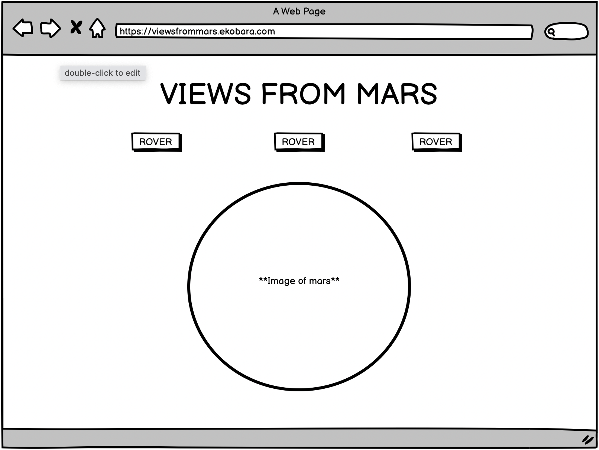
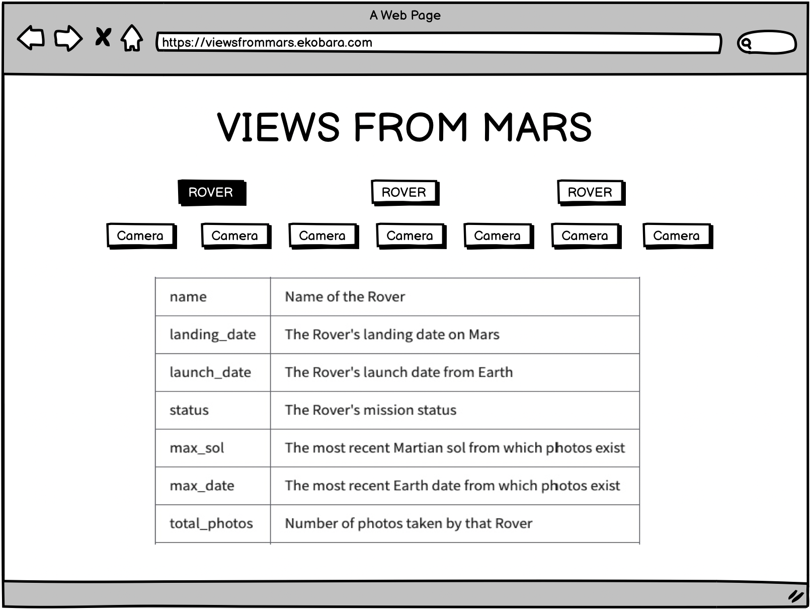
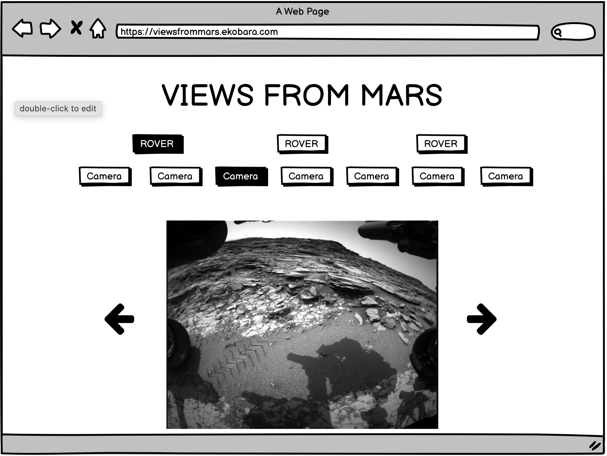

# Views From Mars
 

## Game Discription

We are all aware of the quest for space exploration thats been on the moinds of many over mellenias. Today, we as a people are making leaps towards the goals of planing a vacation to a nearby star system (small steps but steps nonetheless). One of those steps is checking out our red neighbor. NASA has sent a few rovers over to MArs to make observations and collect data. This includes a series of photograths that are then sent over to Earth to be analized. This app uses the NASA Mars Rover API to display those photos.

## API

> https://api.nasa.gov/mars-photos/api/v1/rovers/curiosity/photos?earth_date=2015-6-3&api_key=DEMO_KEY

---
## Component Heirechy

App -> Rover -> Camera -> Photos

---
## User Stories

**MVP**

- As a user, I want to see pictures 
- As a user, I what to be able to choose which rovers pictures i see
- As a user, I what to know some information about the rover i chose
- As a user, I what to select the camera
- As a user, I want to navigate between pictures

**Bronze**:

- As a user, I want to choose the date the picture was taken 
- As a user, I want to select the amount of pictures

**Silver**:

- As a user, I want the pictures i seen saved

**Gold**:

- As a user, I want to download the pictures seen 
- As a user, I want to share the pictures
- As a user, I want an acoount to save my favorite pictures to
- As a user, I want a moon

## Wireframes

